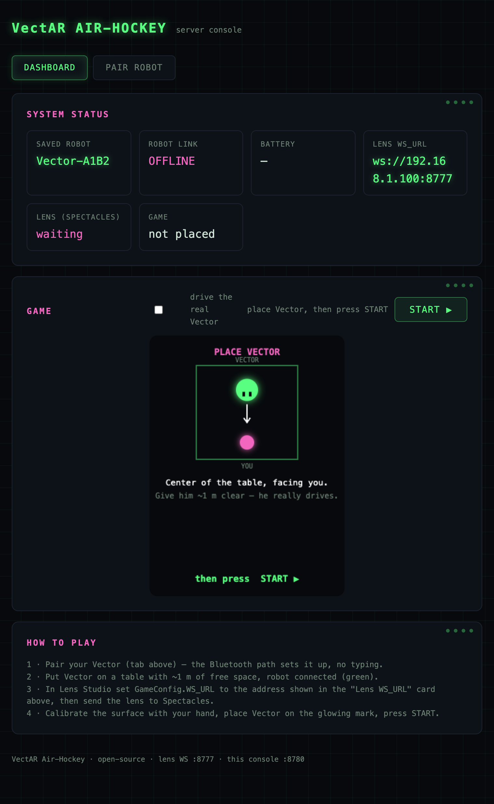

# VectAR Air-Hockey

**Play air hockey against a real robot — in augmented reality.**

A physical [Anki Vector](https://en.wikipedia.org/wiki/Anki_(company)) robot
defends his goal on your table while you smash a virtual neon puck at him
through [Snap Spectacles (2024)](https://www.spectacles.com/). The puck, the
field, the score chip and the lightning are AR; the goalie — his drives, his
saves, his trash-talk and his sore-loser dance — is a real machine.

<!-- 📹 demo clip / GIF here -->

```
Spectacles lens  ── ws://mac:8777 ──  Mac game server  ── gRPC :443 ──  Vector robot
(puck physics,                        (goalie AI,                       (drives, saves,
 score, AR field)                      safety, voice)                    talks, dances)
```

The Mac runs a small web console for pairing, monitoring, and a mouse-playable
fallback game:



## What you need

| Thing | Notes |
|---|---|
| Anki / DDL **Vector** robot (1.0 or 2.0) | stock is fine — the pairing wizard onboards him for you (built on [wire-pod](https://github.com/kercre123/wire-pod), the community standard since the official cloud shut down) |
| **Snap Spectacles (2024)** | + [Lens Studio 5.15](https://ar.snap.com/download) on your Mac |
| A **Mac** | Python 3.12; runs the game server |
| One **Wi-Fi network** | Mac + robot + Spectacles all on the same LAN |

## Quickstart

**1 · Server**

```bash
cd server
python3.12 -m venv .venv && source .venv/bin/activate
pip install -r requirements.txt
export PROTOCOL_BUFFERS_PYTHON_IMPLEMENTATION=python
python -m game_bridge.main
```

Open **http://localhost:8780** → **PAIR ROBOT** → **CONNECT VECTOR**. One
progressive wizard finds your robot over Bluetooth, points him at the bundled
wire-pod server (a one-time step — firmware for a stock Vector, SSH for an OSKR
one), joins him to Wi-Fi, and authorizes the Mac. It detects which kind of robot
you have and skips whatever is already done.
**[docs/SETUP_ROBOT.md](docs/SETUP_ROBOT.md)** explains exactly what happens for
each robot type; [docs/PAIRING.md](docs/PAIRING.md) has the internals.

**2 · Lens**

Open `lens/robo-hockey-515.esproj` in Lens Studio 5.15, set your Mac's LAN IP
in `Assets/Scripts/GameConfig.ts` (`WS_URL`), enable *Experimental APIs*, and
send to your Spectacles. Full guide: [docs/LENS.md](docs/LENS.md).

**3 · Play**

Clear ~1 m of table. Calibrate the surface with your palm, place Vector on the
glowing pad facing you, press the arcade START button. First to 5 wins —
Vector celebrates or grieves accordingly.
[docs/GAMEPLAY.md](docs/GAMEPLAY.md) has the details.

## Documentation

- [ARCHITECTURE](docs/ARCHITECTURE.md) — how the three machines share one game
- [SETUP_ROBOT](docs/SETUP_ROBOT.md) — **start here**: what the wizard does for a stock vs OSKR robot, and the one-time setup each needs
- [PAIRING](docs/PAIRING.md) — robot setup internals: wire-pod, the cert/guid mint
- [SERVER](docs/SERVER.md) — install, config, goalie tuning, troubleshooting
- [LENS](docs/LENS.md) — Lens Studio project setup + optional voice agent
- [PROTOCOL](docs/PROTOCOL.md) — the WebSocket protocol between lens and server
- [GAMEPLAY](docs/GAMEPLAY.md) — session flow, rules, interaction design
- [GLOWKIT](docs/GLOWKIT.md) — the procedural neon toolkit (reusable in your own lenses)

AI agents: start at [CLAUDE.md](CLAUDE.md) / [AGENTS.md](AGENTS.md).

## Optional extras

- **Vision positioning** — an on-device YOLO model (`lens/Assets/ML/best.onnx`,
  included) watches the real robot through the Spectacles camera and corrects
  odometry drift. Works out of the box; see [docs/LENS.md](docs/LENS.md).
- **In-game voice agent** — talk to Vector mid-game; a Gemini persona answers
  through the robot's own TTS. Needs your own (free) Remote Service Gateway
  token; see [docs/LENS.md](docs/LENS.md#voice-agent).

## Credits

- **[Pavlo Tkachenko](https://github.com/PtPavloTkachenko)** — creator, design,
  direction, hardware/RE, and everything on real Spectacles + a real robot.
- **[Claude Code](https://claude.com/claude-code)** (Anthropic, Opus 4.8) —
  pair-programmed the engine, the pairing wizard, and these docs. Commit history
  carries the `Co-Authored-By` trail.
- **[wire-pod](https://github.com/kercre123/wire-pod)** by **Kerigan Creighton**
  — the community "cloud" this whole thing stands on. Please go star it.
- **Snap Spectacles** + the Spectacles Interaction Kit — the AR platform.

## License

MIT for everything authored in this repo — see [LICENSE](LICENSE).
Third-party packages and assets keep their own licenses — see
[THIRD_PARTY_NOTICES.md](THIRD_PARTY_NOTICES.md).

Not affiliated with Snap Inc., Anki, or Digital Dream Labs. Vector is a
trademark of its respective owner; you need your own robot.
