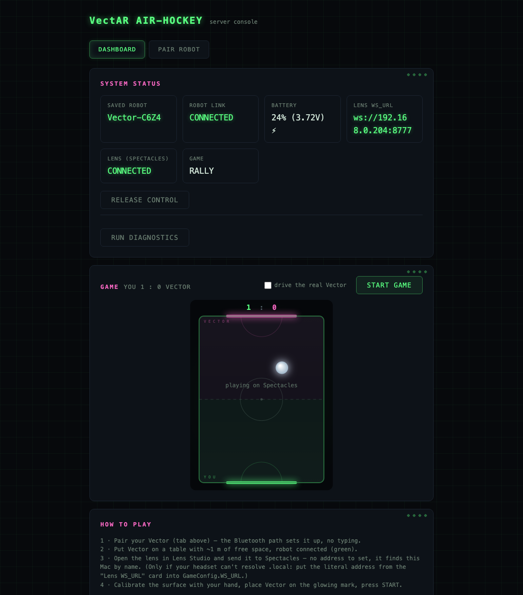

# VectAR Air-Hockey

**Play air hockey against a real robot — in augmented reality.**

A physical [Anki Vector](https://en.wikipedia.org/wiki/Anki_(company)) robot
defends his goal on your table while you smash a virtual neon puck at him
through [Snap Spectacles (2024)](https://www.spectacles.com/). The puck, the
field, the score chip and the lightning are AR; the goalie — his drives, his
saves, his trash-talk and his sore-loser dance — is a real machine.

<!-- 📹 demo clip / GIF here -->

```
Spectacles lens  ── ws://mac:8777 ──  Mac game server  ── gRPC :443 ──  Vector robot
(puck physics,                        (goalie AI,                       (drives, saves,
 score, AR field)                      safety, voice)                    talks, dances)
```

The Mac runs a small web console for pairing, monitoring, and a mouse-playable
practice field (you against a simulated goalie, for testing without the robot):



## What you need

| Thing | Notes |
|---|---|
| Anki / DDL **Vector** robot (1.0 or 2.0) | the pairing wizard onboards him for you, built on [wire-pod](https://github.com/kercre123/wire-pod) (the community standard since the official cloud shut down). **Stock** and **OSKR/dev** robots are both verified end-to-end from a factory reset — see [Project status](#project-status) |
| **Snap Spectacles (2024)** | + [Lens Studio 5.15](https://ar.snap.com/download) on your Mac |
| A **Mac** | Python 3.12; runs the game server |
| One **Wi-Fi network** | Mac + robot + Spectacles all on the same LAN |

## Quickstart

**1 · Server**

```bash
git lfs install && git lfs pull      # the robot firmware images (~355 MB)
cd server
python3.12 -m venv .venv && source .venv/bin/activate
pip install -r requirements.txt
export PROTOCOL_BUFFERS_PYTHON_IMPLEMENTATION=python
python -m game_bridge.main
```

> The firmware images ship with the repo through **Git LFS**, so a stock robot
> can be flashed over your own LAN with nothing to download by hand. Skipping
> `git lfs pull` leaves 130-byte pointer files behind — the server refuses to
> serve those as firmware, and `python -m game_bridge.doctor` says so. Without
> them the install still works by streaming from the Internet Archive, just
> slower and only while that stays up.

Open **http://localhost:8780** → **PAIR ROBOT** → **CONNECT VECTOR**. One
progressive wizard finds your robot over Bluetooth, points him at the bundled
wire-pod server (a one-time step — firmware for a stock Vector, SSH for an OSKR
one), joins him to Wi-Fi, and authorizes the Mac. It detects which kind of robot
you have and skips whatever is already done.
**[docs/SETUP_ROBOT.md](docs/SETUP_ROBOT.md)** explains exactly what happens for
each robot type; [docs/PAIRING.md](docs/PAIRING.md) has the internals.

**2 · Lens**

Open `lens/robo-hockey-515.esproj` in Lens Studio 5.15, enable *Experimental
APIs*, and send it to your Spectacles — the address needs no editing: the
server publishes itself as `vectar.local`, which is what the Lens already
dials. Full guide: [docs/LENS.md](docs/LENS.md).

There is also a Lens Studio 5.23 port — open
`lens-523/robo-hockey-523.esproj` instead. Same game, same server, migrated
project: [docs/LENS_523.md](docs/LENS_523.md).

**3 · Play**

Clear ~1 m of table. Calibrate the surface with your palm, place Vector on the
glowing pad facing you, press the arcade START button. First to 5 wins —
Vector celebrates or grieves accordingly.
[docs/GAMEPLAY.md](docs/GAMEPLAY.md) has the details.

## Project status

**The full chain — Spectacles → this server → a real Vector driving — has been
demonstrated end-to-end in two earlier builds: this air-hockey game, and the
first version of VectAR OS** (the wider robot + AR + AI system it grew alongside).
The goalie drove, blocked, and talked; the AR field and the robot ran as one
game. That capability isn't the open question.

The recent work was **automating the setup**. Two robots were **factory-reset on
purpose** to build the *out-of-the-box* path — what someone setting up a robot
from scratch actually goes through — and turn a day of manual SSH, certs, cloud
config and token wrangling into a few clicks, so this and future robot projects
can get a Vector online in minutes. **Both kinds of robot now go from a factory
reset to SDK control through the console alone**, and nothing in the flow needs
a terminal.

Where each piece stands today:

- **Spectacles ↔ server — verified live on device.** The lens runs on Spectacles
  and its WebSocket link to this server is tested end-to-end: surface
  calibration, the AR field, puck physics and scoring.
- **Stock robot, out of the box → authorized — verified end-to-end on hardware
  (2026-07-25).** A brand-new consumer Vector, never signed into the official
  app, went through the wizard in one sitting: Bluetooth pairing, PIN, Wi-Fi,
  the escape-pod firmware install (he downloads ~180 MB from your Mac and
  reboots himself), his sign-in to the pairing engine, and minting this Mac's
  SDK control token. **Nothing typed by hand, and the Vector app is never
  needed.**
- **Server ↔ robot control** — the SDK layer has driven a real robot (wheels,
  head, eyes, faces, voice, goalie AI, safety) and is reached over the token
  minted above.

The onboarding automation splits into two independent tracks:

- **Stock (consumer) Vector** — **verified end-to-end**, as above. Budget ~10
  minutes, most of it waiting on the firmware install and one reboot. That
  install redirects his cloud to your Mac for good, which a factory reset does
  **not** undo — what that costs you day to day, and how to put him back on
  stock firmware, is in
  [SETUP_ROBOT.md](docs/SETUP_ROBOT.md#what-the-firmware-install-changes).
- **OSKR / dev Vector** — **verified end-to-end too**, from a factory reset. He
  needs no firmware at all: the wizard takes his own SSH key off him over
  Bluetooth (measured: 55 KB in 26 s), repoints his cloud over SSH, and one
  reboot later he is minted and answering. Shorter than the stock path, since
  there is no 180 MB install.

> **Recovery mode is a dead end, and it does not announce itself.** Holding his
> backpack button ~15 s puts him in recovery; ~5 s is the plain power-off. In
> recovery he reports neither his build type nor his serial, so nothing can tell
> a dev robot from a stock one; he has no `/data/ssh` and none of his services,
> so there is nothing to set up; and his own build-type gate refuses the
> escape-pod image (error 214). Take him out of recovery first — anything set up
> before that has to be done again, including Wi-Fi.

**The old open item is closed.** A robot with no SDK control token (wiped, or
brand new) never re-mints one just by sitting on Wi-Fi — `vic-cloud` has to be
*told* to sign in, and that trigger is a Bluetooth message the wizard now sends
during Authorize. Background: [PAIRING_86_DEEPDIVE](docs/PAIRING_86_DEEPDIVE.md).

**More than one robot.** Run the wizard again and the second Vector joins the
first; the dashboard's **Your robots** card is where you say which one plays,
and switching is a click, not another setup. The Lens never picks a robot — it
takes whoever the server hands it, which is what keeps it a display-and-input
bridge with no decisions of its own. Telemetry from several robots at once is
the next thing being built. Details: [SERVER → More than one
robot](docs/SERVER.md#more-than-one-robot).

Details and the risk notes worth reading before you flash anything:
[SETUP_ROBOT → Status & risks](docs/SETUP_ROBOT.md#status--risks-read-before-you-start).

## Documentation

- [ARCHITECTURE](docs/ARCHITECTURE.md) — how the three machines share one game
- [SETUP_ROBOT](docs/SETUP_ROBOT.md) — **start here**: what the wizard does for a stock vs OSKR robot, the one-time setup each needs, and the status/risk notes
- [PAIRING](docs/PAIRING.md) — robot setup internals: wire-pod, the cert/guid mint
- [STOCK_SIGNIN_TRIAGE](docs/STOCK_SIGNIN_TRIAGE.md) — everything green but Authorize 404s: why only the robot can write that certificate, and how to tell which half is stuck
- [PAIRING_86_DEEPDIVE](docs/PAIRING_86_DEEPDIVE.md) — the open token item: full reverse-engineering log, what's proven, what's next
- [BLE_PROTOCOL_OFFICIAL](docs/BLE_PROTOCOL_OFFICIAL.md) — byte-level spec of Anki's BLE onboarding protocol, from the official setup app
- [SERVER](docs/SERVER.md) — install, config, goalie tuning, troubleshooting
- [LENS](docs/LENS.md) — Lens Studio project setup + optional voice agent
- [LENS_523](docs/LENS_523.md) — the 5.23 / SPECS port: what the migration changed, the quantised detector, what is still untested
- [PROTOCOL](docs/PROTOCOL.md) — the WebSocket protocol between lens and server
- [GAMEPLAY](docs/GAMEPLAY.md) — session flow, rules, interaction design
- [GLOWKIT](docs/GLOWKIT.md) — the procedural neon toolkit (reusable in your own lenses)

AI agents: start at [CLAUDE.md](CLAUDE.md) / [AGENTS.md](AGENTS.md).

## Optional extras

- **Vision positioning** — an on-device YOLO model (`lens/Assets/ML/best.onnx`,
  included) watches the real robot through the Spectacles camera and corrects
  odometry drift. Works out of the box; see [docs/LENS.md](docs/LENS.md).
- **In-game voice agent** — talk to Vector mid-game; a Gemini persona answers
  through the robot's own TTS. Needs your own (free) Remote Service Gateway
  token; see [docs/LENS.md](docs/LENS.md#voice-agent).

## Credits

- **[Pavlo Tkachenko](https://github.com/PtPavloTkachenko)** — creator, design,
  direction, hardware/RE, and everything on real Spectacles + a real robot.
- **[Claude Code](https://claude.com/claude-code)** (Anthropic, Opus 4.8) —
  pair-programmed the engine, the pairing wizard, and these docs. Commit history
  carries the `Co-Authored-By` trail.
- **[wire-pod](https://github.com/kercre123/wire-pod)** by **Kerigan Creighton**
  — the community "cloud" this whole thing stands on. Please go star it.
- **Snap Spectacles** + the Spectacles Interaction Kit — the AR platform.

## License

MIT for everything authored in this repo — see [LICENSE](LICENSE).
Third-party packages and assets keep their own licenses — see
[THIRD_PARTY_NOTICES.md](THIRD_PARTY_NOTICES.md).

Not affiliated with Snap Inc., Anki, or Digital Dream Labs. Vector is a
trademark of its respective owner; you need your own robot.
