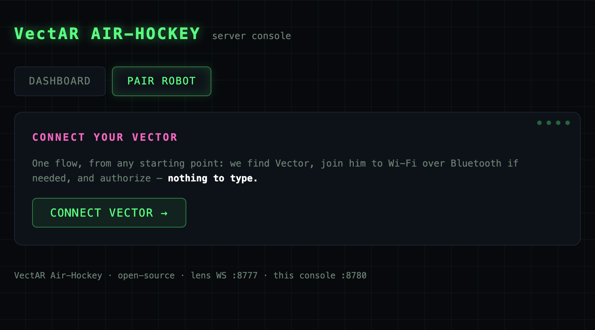
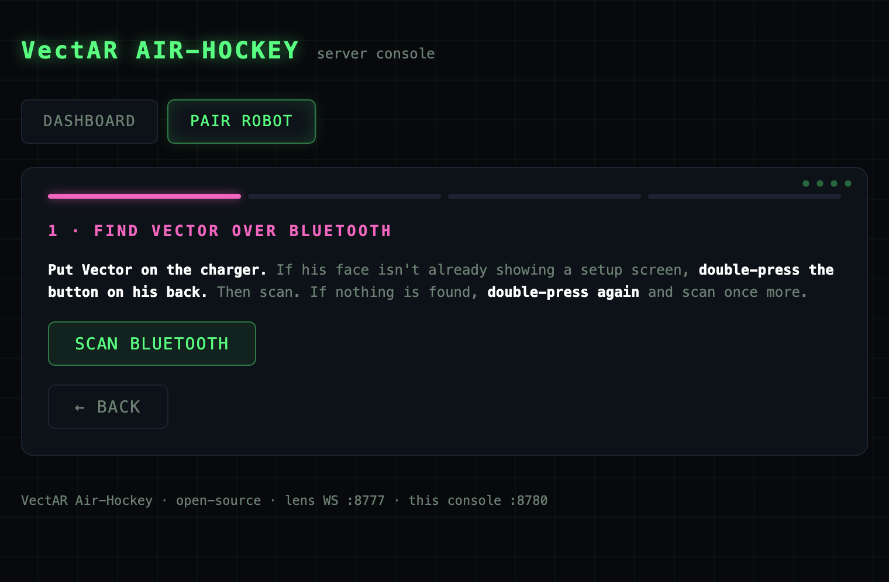
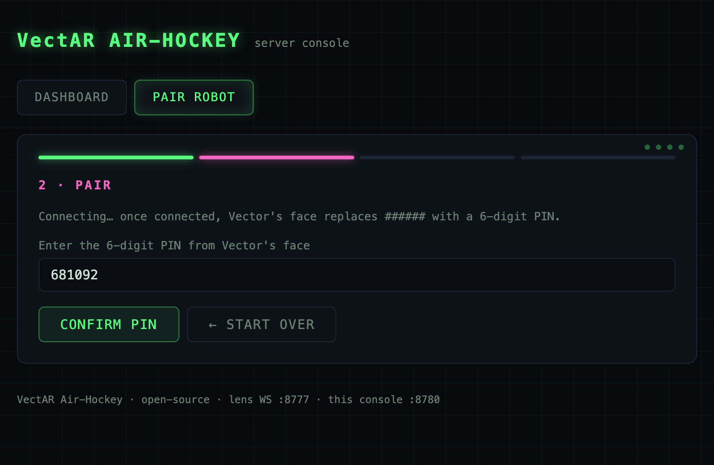
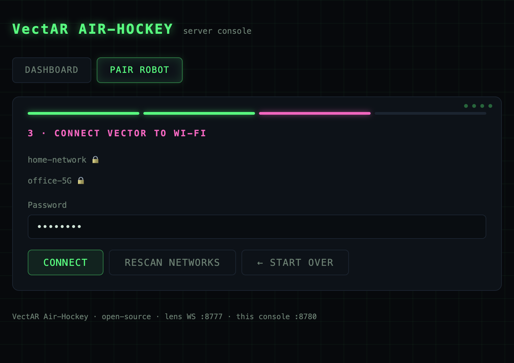
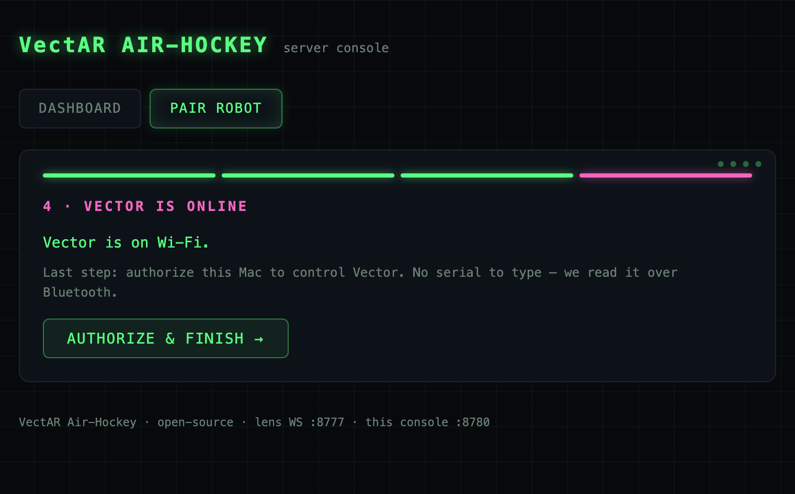
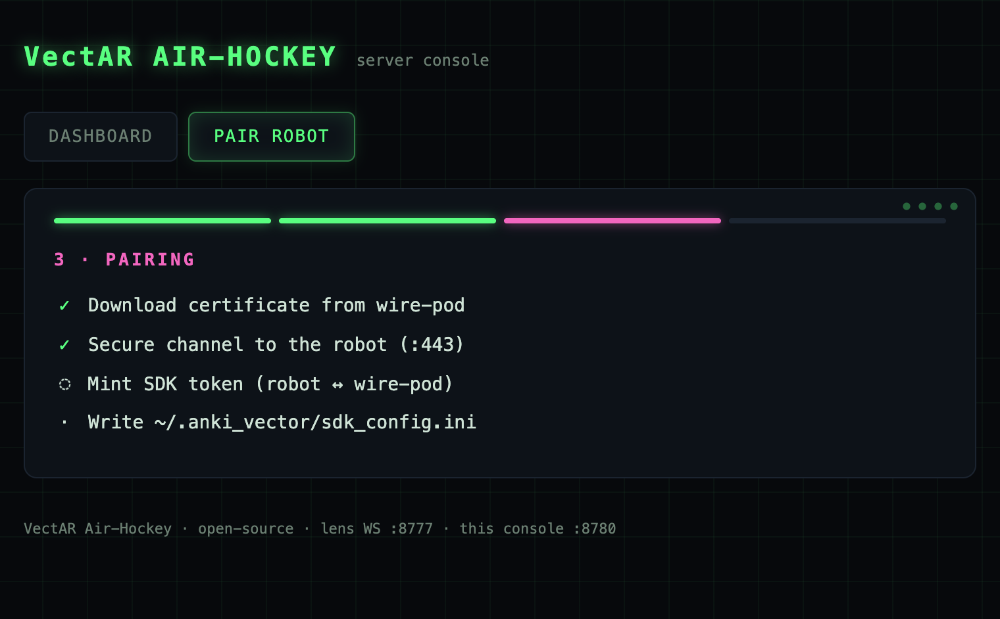
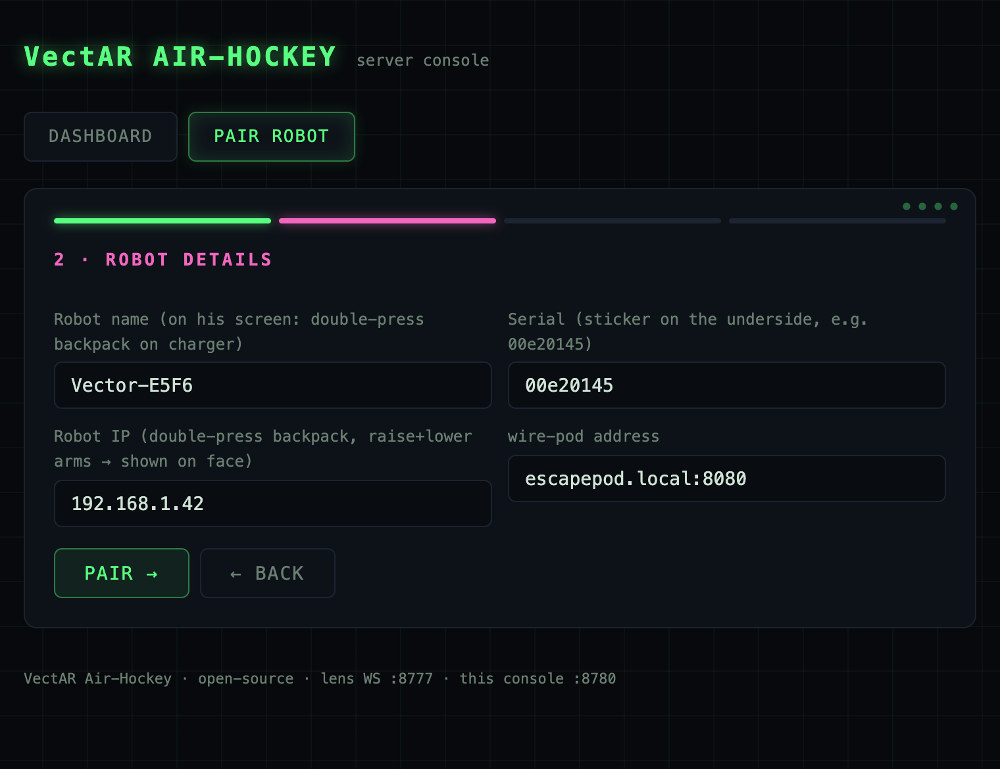
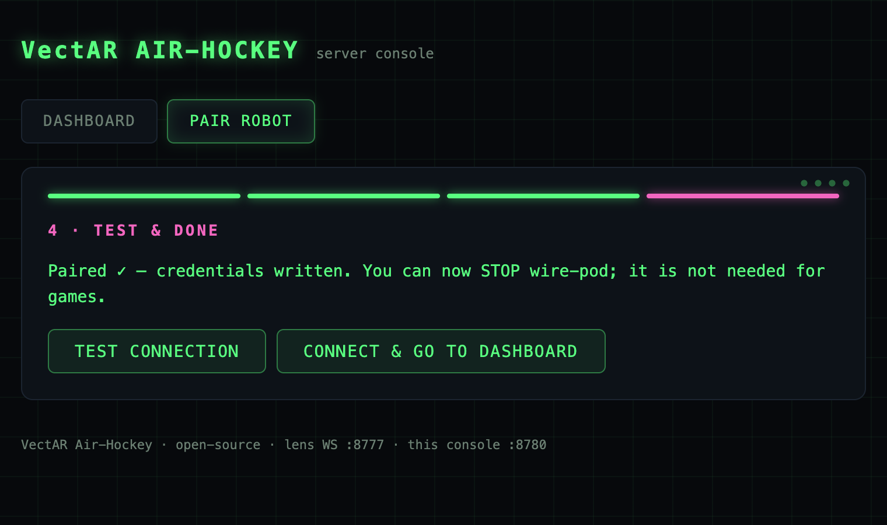

# Pairing your Vector

One web wizard does everything: it finds your Vector, gets him onto Wi-Fi over
Bluetooth if he isn't already, and authorizes this Mac to control him — **with
nothing to type**. After pairing, the game talks to the robot directly
(Mac→robot); no background service needs to stay running for gameplay.

Start the server and open the console:

```bash
cd server && source .venv/bin/activate
export PROTOCOL_BUFFERS_PYTHON_IMPLEMENTATION=python
python -m game_bridge.main
```

Open **http://localhost:8780** → **PAIR ROBOT** → **CONNECT VECTOR**.



The wizard is progressive — it skips whatever is already done. A stock,
never-configured Vector walks the full path; a Vector already on your Wi-Fi
jumps straight to authorization.

## Why a "cloud" is involved at all

Anki (and later DDL) shut Vector's cloud down. A Vector without a server can't
finish onboarding, and — the part we care about — nothing can issue the **SDK
auth token** the game logs in with.
[wire-pod](https://github.com/kercre123/wire-pod) is the open-source
replacement the community runs at home. This project bundles a **trimmed copy**
of it (voice/STT removed) under `server/onboarding/wire-pod/`, so the wizard can
onboard and authorize a stock robot without a separate install. All credit for
wire-pod goes to **Kerigan Creighton** — see
[THIRD_PARTY_NOTICES](../THIRD_PARTY_NOTICES.md).

## The steps

### 1 · Find Vector over Bluetooth

Put Vector on the charger. If his face isn't already on a setup screen,
**double-press the button on his back**, then scan. (Nothing found?
Double-press again and rescan.)



### 2 · Confirm the PIN

Once connected, Vector shows a **6-digit PIN** on his face. Type it in — this
sets up the encrypted Bluetooth channel.



### 3 · Join Wi-Fi

The wizard lists the networks Vector can see. Pick yours, enter the password,
and he connects — all over Bluetooth, so no cables and no app.



### 4 · Authorize this Mac

Last step, and it's automatic: the serial is read over Bluetooth, so there's
nothing to type. The wizard mints the SDK token and writes the standard
`~/.anki_vector/sdk_config.ini`.



Under the hood this stage:

- downloads the robot's TLS certificate (`/session-certs/<serial>`),
- opens a pinned TLS channel to the **robot** on port 443 and calls
  `UserAuthentication`; the robot forwards it to its trusted server, which
  mints a fresh **guid** token,
- writes `~/.anki_vector/sdk_config.ini` + the cert file — the standard
  `anki_vector` SDK location, so any other SDK tool you own works too.



Token minting is **append-only** on the robot: re-pairing (new Mac, new IP,
re-install) never invalidates previously issued tokens.

## Already on Wi-Fi? The manual path

If your Vector is already online (e.g. onboarded earlier), you can skip
Bluetooth and just give his details directly, then authorize:



- **Robot name** — `Vector-XXXX`, shown on his screen after a backpack
  double-press on the charger.
- **Serial** — sticker on his underside, e.g. `00e20145`.
- **Robot IP** — double-press the backpack, then raise+lower his arms; the IP
  shows on his face.
- **wire-pod address** — default `escapepod.local:8080`; use the host machine's
  IP if `.local` doesn't resolve.

Finish with a quick connection check, then hand the robot to the game loop:



## After pairing

Gameplay authenticates directly against the robot (vic-gateway checks the guid
locally), so the onboarding service does not need to keep running. Keep it
around only for future re-pairings or voice work.

## Failure messages decoded

| Wizard error at… | Likely cause |
|---|---|
| *certificate* — can't reach the server | onboarding service not running / wrong address; try `<host-ip>:8080` instead of `escapepod.local` |
| *certificate* — no cert for serial | typo in serial, or the robot was onboarded by a DIFFERENT instance |
| *certificate* — name mismatch | name/serial belong to different robots |
| *secure channel* — 15 s timeout | robot off / asleep off-charger, wrong IP (DHCP moved him — recheck on his face), different network |
| *secure channel* — TLS failure after re-onboarding | cert rotated: re-run the wizard |
| *mint* — refused / not authorized | robot can't reach its onboarding server right now, or trusts a different one — restart it and retry |

## CLI alternative

The SDK's own interactive tool does the authorization stage in a terminal:

```bash
python -m anki_vector.configure
```

Our wizard exists so you don't have to babysit prompts — and it doubles as a
live dashboard (robot link, battery, field pose, lens connection, game state)
during play. See [SERVER.md](SERVER.md).
